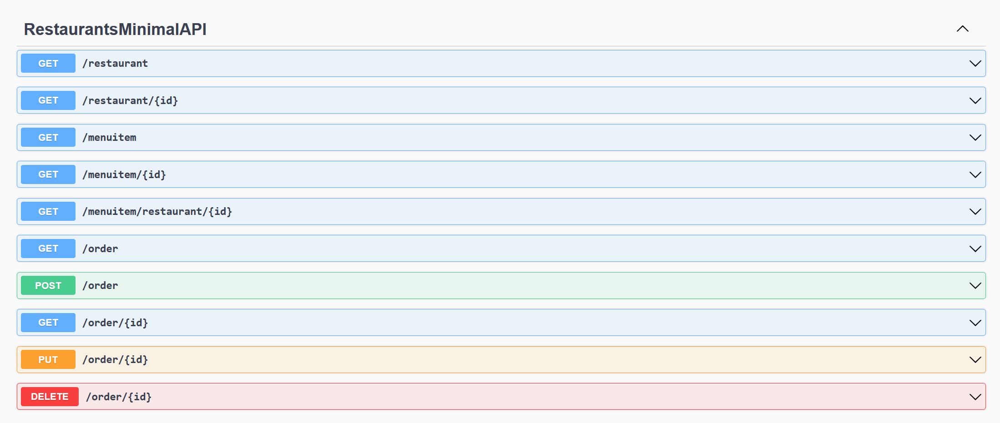
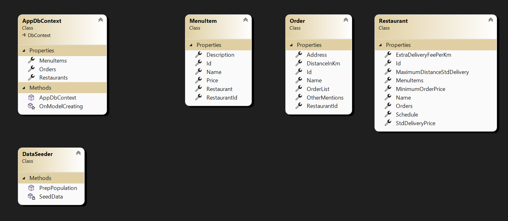

This solution is composed of 2 projects:

- RestaurantsMinimalAPI (a minimal api project type in .net 6)
- RestaurantsClient ( a client side application project made with blazor webassembly in .net 6)

The RestaurantsMinimalAPI has the following endpoints:

 

The RestaurantsMinimalAPI has the following classes:

 

 1 AddDbContext - provides configuration for the inmemory database used for the example.

 2 DataSeeder - provides initial database seeding through the static PrepPopulation method.
 
 3 Restaurant, MenuItem and Order - provide the models which are used by the EntityFrameworkCore to work with the database.

 The RestaurantsClient has the following app pages:
 - Index (http://localhost/)- used to show the initial page and show all the restaurants (the restaurant that are outside of active schedule have the link button disabled); the buttons display the pages for individual restaurants
 - RestaurantMenu (http://localhost/restaurant/{Id:int}) - this is the page for the selected restaurant; this displays menu items and permits adding them to the cart with the "Add to Cart" button; the cart gets updated with the total numbers of picked menu items; the "Checkout" button goes to the Cart page (for Order Completion)
 - Cart (http://localhost/cart/{Id:int}) - displays the items in the cart for the selected restaurant; items can be remove with the "Remove" button; in the lower part of the page is the order details section which contains a form for user data input like name, address, delivery distance and other mentions; in the order details form there is a "Check Delivery Price" which displays the calculated price for the transport and the total price; the "Submit Order" button submit the completed order and redirects the user to the Index page
 - AboutUs and ContactUs - provide placeholder extra information about the company
 - OrderList (http://localhost/orders) - provides a page to visualise all the orders made indifferent of restaurant and all their saved details 

The projects are configured to run on http for development simplicity. The client app doesn't implement form validation, complex exception handling, tests and other production goodies for brevity sake.